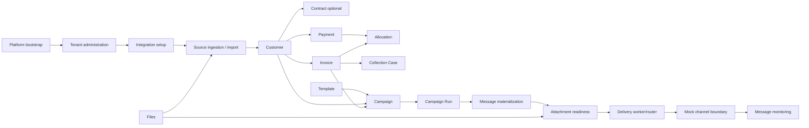

# Collectra — Functional Hardening User Journeys and Smoke Plan

Status: IMPLEMENTATION-READY BASELINE
Branch: spec/functional-hardening-user-journeys
Base: main@8704e425ca6ea92d277da136cdfe84d07ebf5057
Gate: before VC-9 Analytics

## 1. Objective

Before VC-9, validate the product as a coherent multi-role system and close functional defects.
Scope ends at the delivery-channel boundary: deterministic mock/local adapters may accept, retry or fail delivery; no real external provider acceptance is required.

This plan is not a new feature roadmap. It is a defect-discovery and closure gate over existing VC-0..VC-8 functionality.

## 2. Authorization model

Runtime system roles are PLATFORM_SUPER_ADMIN, TENANT_ADMIN and TENANT_USER. Business roles below are personas mapped to explicit permissions; UI and tests must not hard-code persona names as authorization.

Personas:
1. Platform Super Admin — platform tenants/users/admins and platform-safe operations.
2. Tenant Administrator — membership, roles, permissions, integration setup and tenant-wide operations.
3. Integration/Data Manager — service clients, source schemas, mappings, IntegrationSource readiness/activation, imports.
4. Operator — customers, contracts, receivables and routine business operations.
5. Collection Officer — overdue work queue, case lifecycle, promise/dispute/action/timeline.
6. Campaign Manager — campaign configuration, audience, run and message monitoring.
7. Content Manager — templates, versions, assets, validation, preview, publication.
8. Support/Ops — safe operational diagnostics and masked delivery state; no business mutation unless explicitly permitted.
9. Auditor/Read-only — read-only tenant reporting/audit surfaces; mutation forbidden.
10. Technical Integration Client — service authentication and source-oriented ingestion.
11. Unauthorized/foreign-tenant actor — negative security persona.

Every protected scenario has positive, insufficient-permission, foreign-tenant and unauthenticated/invalid-auth variants where applicable.

## 3. Product process map

Golden business path:
Tenant/Admin -> integration configuration -> idempotent CUSTOMER/INVOICE/PAYMENT ingestion -> receivable/payment visibility -> allocation -> collection case -> template -> campaign -> run -> message -> attachment gate -> deterministic channel result -> monitoring.

## 4. Persona journeys

### J01 Platform Super Admin
Login to /platform -> overview -> tenants -> tenant detail -> users -> user detail -> administrators.
Smoke: lists load, paging/filter boundaries, tenant/user detail deep links, cross-scope separation, tenant auth cannot enter platform surface.
Known placeholders are recorded as gaps, not silently counted as implemented: platform analytics/audit/operations.

### J02 Tenant Administrator
Tenant login -> bootstrap identity -> members -> invite -> roles/permissions -> assign role -> verify changed access -> service clients/integration configuration.
Smoke: last-admin/lifecycle conflicts, revoked access, stale token re-authorization, 403 for missing permission, tenant B identifiers never expose tenant B data.

### J03 Integration/Data Manager
Service Client -> Source Schema -> Mapping Profile -> IntegrationSource -> readiness -> remediation -> activate -> submit/inspect import.
Smoke: version conflicts, invalid mapping/schema, inactive source, blocked client, scope denial, idempotency replay and same-key/different-body conflict.

### J04 Operator / Customer Care
Dashboard -> customers -> customer detail -> contacts/segments -> optional contract -> receivables -> invoice/payment -> allocation/reversal.
Smoke: deep links, server paging, decimal strings, currency/customer mismatch, duplicate commandId, 409 reload/reconciliation, authoritative outstanding/payment state.

### J05 Collection Officer
Overdue invoice -> collection queue -> open case -> start -> promise/dispute/action -> timeline -> hold/close.
Smoke: overdue/due filters, assignee permissions, child paging, version conflict, terminal transition rejection, timeline immutable, receivable state not mutated by UI inference.

### J06 Content Manager
Templates -> create -> version -> builder -> placeholders/assets -> validate -> preview -> publish.
Smoke: invalid placeholders, channel compatibility, locale/Unicode, XSS-safe content handling, published immutability, tenant isolation, asset authorization.

### J07 Campaign Manager
Campaign -> audience -> template/channel -> activate -> prepare run -> recipients -> messages -> message detail.
Smoke: empty/single/many audience, eligibility changes, duplicate start/prepare intent, terminal polling stop, masked destination, safe error, attachment readiness, no fabricated attempt history, no manual retry/cancel.

### J08 Support/Ops
Open operational message/run diagnostics -> inspect normalized error/provider id/attempt count -> correlate without raw PII/provider body.
Smoke: masked data only, no secrets/body/content in UI/logs, foreign tenant non-disclosure, read-only behavior.

### J09 Auditor/Read-only
Read permitted business/audit views -> filter/page -> attempt mutation.
Smoke: reads work only for granted permissions; every mutation returns 403/no state change. Analytics UI is excluded until VC-9 but existing reporting APIs may be contract-smoked separately.

### J10 Technical Integration Client
Authenticate service -> submit source payload with Idempotency-Key -> poll durable operation -> inspect canonical record outcomes.
Smoke: CUSTOMER/INVOICE/PAYMENT, replay, changed-body conflict, invalid schema, oversized/unsupported input, suspended source, blocked/expired credential, insufficient scope, cross-tenant IDs.

## 5. Functional smoke suites

### S1 Identity and authorization
Login/refresh/logout; disabled/revoked user; permission navigation; backend re-authorization; 401/403/404 non-disclosure; tenant isolation.

### S2 Integration setup
Service client create/rotate/block; schema and mapping lifecycle; IntegrationSource readiness/activate/suspend/archive; stale version.

### S3 Ingestion/import
JSON/XML/CSV/XLSX where currently supported; canonical CUSTOMER/INVOICE/PAYMENT; partial record diagnostics; replay/conflict; Unicode; parser/file safety.

### S4 Customer/contract
Customer CRUD supported by UI/API; contacts primary invariant; segments; optional contract lifecycle; deep links.

### S5 Receivables
Invoice/payment visibility; allocation/reversal; decimal precision; currency/customer invariants; idempotency; authoritative balances.

### S6 Collections
Queue -> case -> promise/dispute/action/timeline; due/overdue; paging; lifecycle and optimistic concurrency.

### S7 Templates/files
Template lifecycle/preview/publish; file registry/upload/detail/download/delete; tenant isolation; safe public DTO; generated/attachment consumer references.

### S8 Campaign/message delivery to channel boundary
Campaign -> run -> message -> worker/router -> deterministic mock outcome for each implemented channel. Assert state, counters, retry behavior, attachment gate, idempotency and monitoring. Stop at adapter boundary; no real provider network is required.

### S9 Recovery/concurrency
Duplicate broker delivery, retry scheduling, stale PROCESSING recovery, worker races, terminal no-op, lock/counter consistency. No sleep-based assertions; bounded observable polling.

### S10 Security/abuse
BOLA/IDOR, forged tenant IDs, injection/filter abuse, XML/CSV/file hazards, oversized page/payload, PII/secret/log redaction, production mock/fault-hook rejection.

## 6. Channel-boundary matrix

For every channel currently routed by the application, exercise:
- SUCCESS;
- PERMANENT_FAILURE;
- TRANSIENT_FAILURE -> retry -> success;
- retry exhaustion;
- RATE_LIMIT where adapter contract supports it;
- TIMEOUT_BEFORE_ACCEPT;
- ACCEPT_THEN_TIMEOUT/ambiguous outcome where modeled;
- malformed/invalid provider response;
- missing/invalid destination;
- required attachment PENDING/FAILED;
- duplicate queue delivery.

Assertions end at Collectra's adapter boundary: correct adapter selected, stable delivery/idempotency key, provider call count, message transition, CampaignRun counters, retry/recovery state and safe monitoring projection.

## 7. Screen/route audit gate

Every existing primary route must be classified REAL, PARTIAL or PLACEHOLDER and mapped to:
persona -> permission -> API -> happy smoke -> negative smoke -> deep-link smoke.

Current audit already identifies /collections as a frontend placeholder despite collection backend/spec existence. This is a pre-VC9 functional gap and must be closed or explicitly waived.
Current /platform/analytics, /platform/audit and /platform/operations are placeholders; platform analytics belongs to VC-9 scope, while audit/operations require explicit product decision rather than accidental release claims.

## 8. Defect register

Create docs/qa/functional-hardening-defects.md with:
ID | severity | persona | journey | route/API | precondition | steps | expected | actual | evidence | owner | status | fix SHA | verification SHA.

Severity:
P0 security/data corruption/cross-tenant;
P1 golden journey blocked or incorrect financial/delivery state;
P2 important workflow/deep-link/error/recovery defect;
P3 UX/diagnostic issue without incorrect business state.

No defect is CLOSED without a reproducing test or explicit verification evidence on its fix SHA.

## 9. Test evidence matrix

Create docs/qa/functional-hardening-smoke-matrix.md.
Each row:
Scenario ID | Persona | Permission set | Tenant | Preconditions | UI route | API | Fixture | Expected DB/business state | Expected UI state | Negative variants | Automated test | Result | SHA.

Required result vocabulary: NOT_RUN, PASS, FAIL, BLOCKED, WAIVED(reason).
Never infer PASS from implementation presence.

## 10. Execution waves

Wave A — inventory:
route/controller/permission matrix; classify REAL/PARTIAL/PLACEHOLDER; map existing automated tests.

Wave B — role journeys:
execute J01-J10 happy paths and authorization negatives; register every deviation.

Wave C — golden business chain:
integration -> ingestion -> customer/invoice/payment -> allocation -> collection -> template -> campaign -> message -> mock channel boundary -> monitoring.

Wave D — channel/recovery:
deterministic outcomes, retry, attachments, duplicate delivery, concurrency and recovery.

Wave E — defect closure:
P0/P1 first, then P2; every fix gets regression test and exact-SHA verification.

Wave F — pre-VC9 gate:
backend verify; PostgreSQL + RabbitMQ Testcontainers; frontend typecheck/test/build; OpenAPI regression; clean DB bootstrap; smoke/security suites.

## 11. Exit criteria before VC-9

- all primary existing VC-0..VC-8 routes classified and tested;
- no unwaived P0/P1 functional defects;
- golden business chain PASS through deterministic delivery-channel boundary;
- persona authorization matrix PASS for positive/negative/cross-tenant cases;
- collections frontend gap resolved or explicitly waived;
- no raw PII/provider payload leakage in monitoring;
- no fabricated delivery attempt history/manual retry in VC-8 UI;
- backend verify + Testcontainers green;
- frontend typecheck/tests/build green;
- OpenAPI regression green;
- clean DB bootstrap green;
- exact verification SHA recorded.

Only then start VC-9 Analytics UI.
