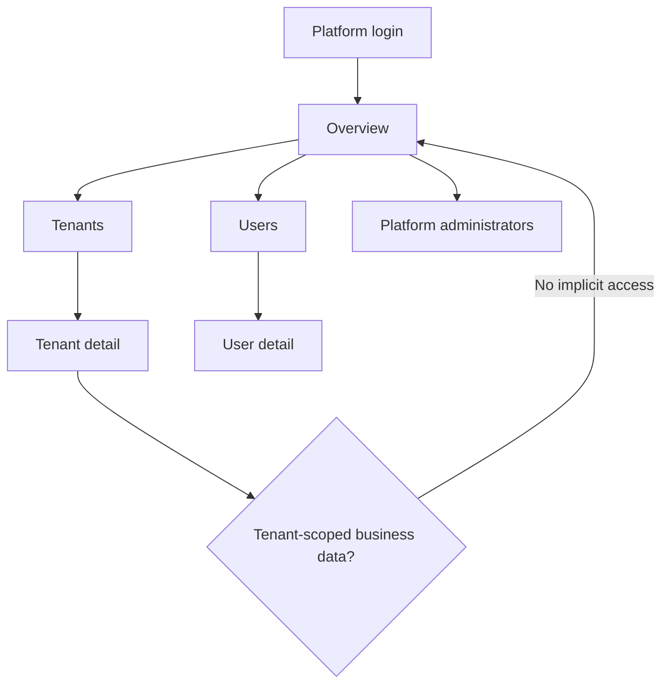
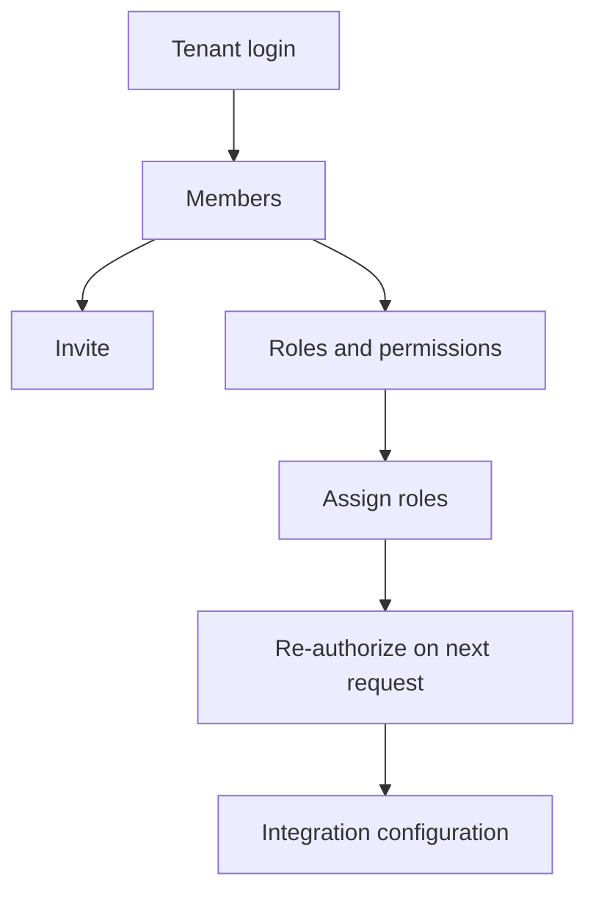
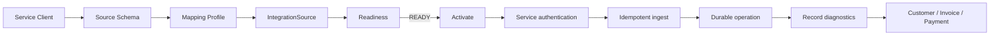
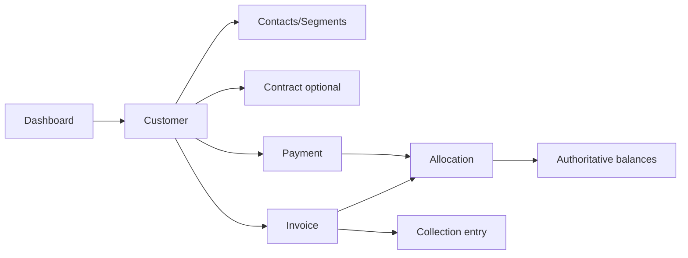
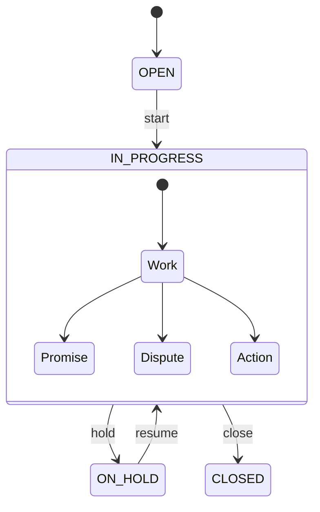
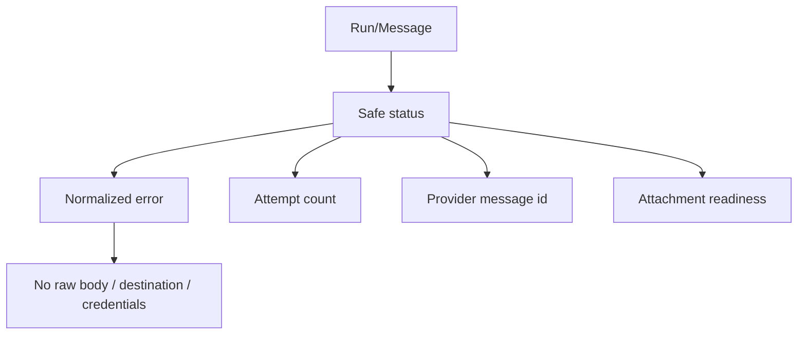
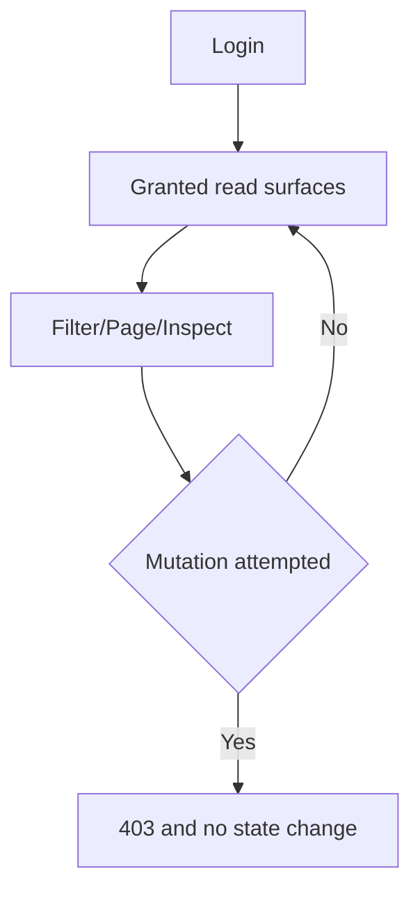

# Collectra — Role Process Diagrams

Status: REVIEW BASELINE

## Platform Super Admin

## Tenant Administrator

## Integration/Data Manager + Technical Client

## Operator / Receivables

## Collection Officer

## Content + Campaign Manager

```mermaid
flowchart LR
 T[Template] --> V[Version]
 V --> VA[Validate]
 VA --> PR[Preview]
 PR --> PU[Publish]
 PU --> C[Campaign]
 C --> AU[Audience]
 AU --> AC[Activate]
 AC --> RUN[Prepare/Run]
 RUN --> M[Messages]
 M --> ATT[Attachment gate]
 ATT --> W[Delivery worker/router]
 W --> CH[Mock channel boundary]
 CH --> MON[Message monitoring]
```

## Support/Ops

## Auditor / Read-only

